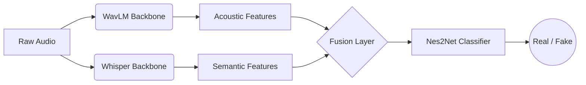

# Audio Deepfake Detection: Semantic & Acoustic Fusion

### 🚀 Final Project: Multi-Modal Deepfake Detection

This project presents a novel approach to Audio Deepfake Detection by fusing two distinct domains:
1.  **Acoustic Domain:** Detecting signal-level artifacts and frequency anomalies (using **WavLM**).
2.  **Semantic/Linguistic Domain:** Detecting unnatural speech patterns, mispronunciations, and lack of fluency (using **Whisper**).

The system utilizes the **Nes2Net** architecture (SOTA 2024) as a lightweight backend classifier to determine if an audio file is **Bonafide** (Real) or **Spoof** (Fake).

---

## 🧠 System Architecture

Our hypothesis is that while modern Deepfake generators are becoming acoustically perfect, they often fail to maintain linguistic consistency. By combining acoustic embeddings with semantic embeddings, we aim to create a more robust detector.



### Components:

* **WavLM (Microsoft):** A massive Self-Supervised Learning (SSL) model trained on 94k hours of audio. Acts as the "Acoustic Eyes," capturing fine-grained signal artifacts.
* **Whisper (OpenAI):** A state-of-the-art ASR model. Acts as the "Semantic/Linguistic Eyes," capturing prosodic and phonetic inconsistencies.
* **Nes2Net:** A lightweight Nested Res2Net architecture that ingests the fused feature vectors and performs the final classification.

---

## 📂 Project Structure

```text
Deepfake_Project/
├── data/                  # Local data (Ignored by Git)
│   ├── raw_audio/         # FLAC files (Train/Test)
│   ├── feats_wavlm/       # Extracted WavLM tensors (.pt)
│   └── feats_whisper/     # Extracted Whisper tensors (.pt)
├── models/
│   ├── nes2net.py         # Clean implementation of Nes2Net
│   └── fusion_system.py   # Integration logic
├── scripts/
│   ├── organize_data.py   # Data preparation and train/test split
│   ├── extract_features.py# Feature extraction (Heavy lifting)
│   └── train_experiments.py # Training loop & Ablation study
├── results/               # Saved models and accuracy logs
└── requirements.txt       # Project dependencies

```

---

## 🛠️ Installation & Setup

### 1. Prerequisites

* Python 3.10
* NVIDIA GPU (Highly Recommended for training)

### 2. Environment Setup

```bash
# Create a virtual environment
python -m venv venv

# Activate environment (Windows)
venv\Scripts\activate

# Install dependencies
pip install -r requirements.txt

```

### 3. Data Preparation (ASVspoof 2019 LA)

1. Download `LA.zip` from the ASVspoof 2019 Datashare.
2. Extract the zip file.
3. Run the organizer script to create a balanced dataset for this POC:
```bash
python scripts/organize_data.py

```

### 4. Feature Extraction

This step runs the heavy backbone models (WavLM/Whisper) **once** and saves the output as `.pt` files. This dramatically speeds up the training process.

```bash
python scripts/extract_features.py

```

*(Note: This process may take time depending on your GPU).*

### 5. Running Experiments

This script runs a full **Ablation Study**, training three separate models sequentially to prove the hypothesis:

1. **Baseline:** WavLM Only.
2. **Semantics:** Whisper Only.
3. **Fusion:** The Combined Model.

```bash
python scripts/train_experiments.py

```
---

## 📊 Experiments & Results

The goal is to demonstrate that the **Fusion** model outperforms the individual components.

| Experiment | Input Source | Dimensions | Goal |
| --- | --- | --- | --- |
| **Exp 1: Acoustic** | WavLM | 768 | Baseline performance on signal artifacts. |
| **Exp 2: Semantic** | Whisper | 768 | Evaluate detection based on linguistic flaws. |
| **Exp 3: Fusion** | **Combined** | **1536** | **Prove that 1+1 > 2** |

---

## 📜 References

This project is based on cutting-edge research in speech anti-spoofing:

* **Nes2Net:** *Liu et al., "Nes2Net: A Lightweight Nested Architecture for Foundation Model Driven Speech Anti-spoofing", 2024.*
* **WavLM:** *Microsoft, "WavLM: Large-Scale Self-Supervised Pre-Training for Full Stack Speech Processing".*
* **Whisper:** *OpenAI, "Robust Speech Recognition via Large-Scale Weak Supervision".*
* **Dataset:** *ASVspoof 2019 Logical Access.*
