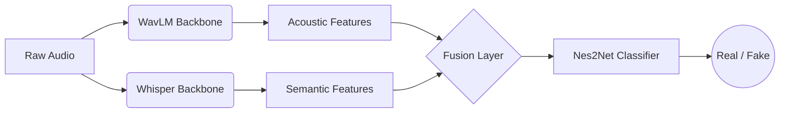

# Audio Deepfake Detection: Semantic & Acoustic Fusion

### 🚀 Final Project: Multi-Modal Deepfake Detection

This project presents a novel approach to Audio Deepfake Detection by fusing two distinct domains:
1.  **Acoustic Domain:** Detecting signal-level artifacts and frequency anomalies (using **WavLM**).
2.  **Semantic/Linguistic Domain:** Detecting unnatural speech patterns, mispronunciations, and lack of fluency (using **Whisper**).

The system utilizes the **Nes2Net** architecture (SOTA 2024) as a lightweight backend classifier to determine if an audio file is **Bonafide** (Real) or **Spoof** (Fake).

---

## 🧠 System Architecture

Our hypothesis is that while modern Deepfake generators are becoming acoustically perfect, they often fail to maintain linguistic consistency. By combining acoustic embeddings with semantic embeddings, we aim to create a more robust detector.

```mermaid
graph LR
    A[Raw Audio] --> B(WavLM Backbone)
    A --> C(Whisper Backbone)
    B --> D[Acoustic Features]
    C --> E[Semantic Features]
    D --> F{Fusion Layer}
    E --> F
    F --> G[Nes2Net Classifier]
    G --> H((Real / Fake))
```

### Components:

* **WavLM (Microsoft):** A massive Self-Supervised Learning (SSL) model trained on 94k hours of audio. Acts as the "Acoustic Eyes," capturing fine-grained signal artifacts.
* **Whisper (OpenAI):** A state-of-the-art ASR model. Acts as the "Semantic/Linguistic Eyes," capturing prosodic and phonetic inconsistencies.
* **Nes2Net:** A lightweight Nested Res2Net architecture that ingests the fused feature vectors and performs the final classification.

---

## 📜 References

This project is based on cutting-edge research in speech anti-spoofing:

* **Nes2Net:** *Liu et al., "Nes2Net: A Lightweight Nested Architecture for Foundation Model Driven Speech Anti-spoofing", 2024.*
* **WavLM:** *Microsoft, "WavLM: Large-Scale Self-Supervised Pre-Training for Full Stack Speech Processing".*
* **Whisper:** *OpenAI, "Robust Speech Recognition via Large-Scale Weak Supervision".*
* **Dataset:** *ASVspoof 2019 Logical Access.*
