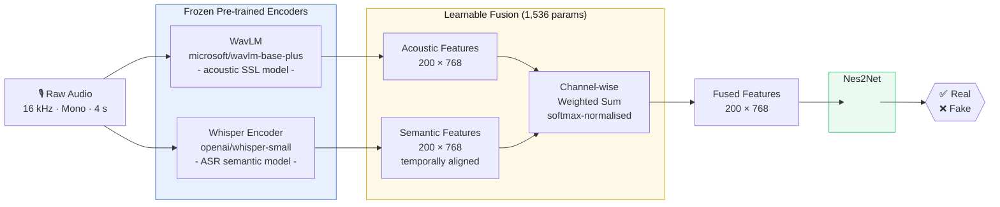
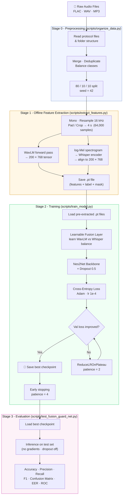

# FusionGuardNet - Audio Deepfake Detection via Acoustic & Semantic Fusion

<p align="center">
  
  
  
</p>

<p align="center">
  A multi-modal deepfake speech detector that fuses <strong>WavLM</strong> acoustic embeddings with <strong>Whisper</strong> semantic embeddings and classifies them using a <strong>Nes2Net</strong> backbone - achieving state-of-the-art accuracy across two benchmark configurations.
</p>

---

## Table of Contents

- [Overview](#overview)
- [Architecture](#architecture)
- [Full Pipeline](#full-pipeline)
- [Key Design Decisions](#key-design-decisions)
- [Datasets](#datasets)
- [Results](#results)
- [Project Structure](#project-structure)
- [Installation](#installation)
- [Usage](#usage)
- [Hyperparameters](#hyperparameters)
- [References](#references)

---

## Overview

Modern text-to-speech and voice conversion systems can synthesize speech that is acoustically indistinguishable from a real human voice, making purely signal-based detectors increasingly fragile. Synthesis errors manifest in **two distinct dimensions**:

- **Acoustic artifacts** - unnatural spectral patterns, phase inconsistencies, and waveform-level distortions
- **Phonetic/prosodic artifacts** - irregular rhythm, imperfect coarticulation, and unnatural linguistic flow

FusionGuardNet tackles both simultaneously by combining two frozen pre-trained encoders that analyse the same audio clip from different perspectives, fusing their output through a learnable layer, and passing the result to a compact Nes2Net classifier. Only the fusion layer and classifier are trained - the large encoders remain frozen throughout.

---

## Architecture


```mermaid
flowchart LR
    A["🎙️ Raw Audio\n16 kHz · Mono · 4 s"] --> B

    subgraph Encoders ["Frozen Pre-trained Encoders"]
        B["WavLM\nmicrosoft/wavlm-base-plus\n- acoustic SSL model -"]
        C["Whisper Encoder\nopenai/whisper-small\n- ASR semantic model -"]
    end

    A --> C

    B --> D["Acoustic Features\n200 × 768"]
    C --> E["Semantic Features\n200 × 768\ntemporally aligned"]

    subgraph Fusion ["Learnable Fusion (1,536 params)"]
        D --> F["Channel-wise\nWeighted Sum\nsoftmax-normalised"]
        E --> F
    end

    F --> G["Fused Features\n200 × 768"]

    subgraph Classifier ["Nes2Net"]
        H[" "]
    end

    G --> H --> K{{"✅ Real\n❌ Fake"}}

    style Encoders fill:#e8f0fe,stroke:#4a7fcc,color:#1a1a1a
    style Fusion fill:#fef9e7,stroke:#d4ac0d,color:#1a1a1a
    style Classifier fill:#eafaf1,stroke:#2ecc71,color:#1a1a1a
    style H fill:transparent,stroke:transparent,color:transparent
```

### Component Details

| Component | Source | Role | Key Properties |
|---|---|---|---|
| **WavLM** `wavlm-base-plus` | Microsoft | Acoustic encoder | Self-supervised, trained on 94k hrs; CNN + Transformer; 768-dim @ 20 ms/frame |
| **Whisper** `whisper-small` | OpenAI | Semantic encoder | ASR model, trained on 680k hrs; encoder-decoder (decoder discarded); 768-dim |
| **Learnable Fusion** | This work | Feature fusion | Channel-wise softmax-gated weighted sum; only **1,536** trainable parameters |
| **Nes2Net** | Liu et al. (2025) | Classifier backend | Nested Res2Net + SE blocks; accepts 768-dim input directly; global avg pooling |

---

## Full Pipeline


```mermaid
flowchart TD
    A["📁 Raw Audio Files\nFLAC · WAV · MP3"] --> B

    subgraph Pre["Stage 0 - Preprocessing  (scripts/organize_data.py)"]
        B["Read protocol files\n& folder structure"]
        B --> C["Merge · Deduplicate\nBalance classes"]
        C --> D["80 / 10 / 10 split\nseed = 42"]
    end

    D --> E

    subgraph Ext["Stage 1 - Offline Feature Extraction  (scripts/extract_features.py)"]
        E["Mono · Resample 16 kHz\nPad / Crop → 4 s  (64,000 samples)"]
        E --> F["WavLM forward pass\n→ 200 × 768 tensor"]
        E --> G["log-Mel spectrogram\n→ Whisper encoder\n→ align to 200 × 768"]
        F --> H["Save .pt file\n(features + label + mask)"]
        G --> H
    end

    H --> I

    subgraph Train["Stage 2 - Training  (scripts/train_model.py)"]
        I["Load pre-extracted .pt files"]
        I --> J["Learnable Fusion Layer\nlearn WavLM vs Whisper balance"]
        J --> K["Nes2Net Backbone\n+ Dropout 0.5"]
        K --> L["Cross-Entropy Loss\nAdam · lr 1e-4"]
        L --> M{"Val loss improved?"}
        M -- Yes --> N["💾 Save best checkpoint"]
        M -- No --> O["ReduceLROnPlateau\npatience = 2"]
        O --> M
        N --> P["Early stopping\npatience = 4"]
    end

    P --> Q

    subgraph Eval["Stage 3 - Evaluation  (scripts/test_fusion_guard_net.py)"]
        Q["Load best checkpoint"]
        Q --> R["Inference on test set\n(no gradients · dropout off)"]
        R --> S["Accuracy · Precision · Recall\nF1 · Confusion Matrix · EER · ROC"]
    end

    style Pre  fill:#f0f4ff,stroke:#7090cc,color:#1a1a1a
    style Ext  fill:#fff7e6,stroke:#d4900d,color:#1a1a1a
    style Train fill:#f0fff4,stroke:#2ecc71,color:#1a1a1a
    style Eval fill:#fdf2f8,stroke:#cc44aa,color:#1a1a1a
```

---

## Key Design Decisions

| Decision | Rationale |
|---|---|
| **Frozen encoders** | Prevents catastrophic forgetting; reduces trainable parameters; feasible on a single GPU |
| **Offline feature extraction** | Avoids repeated inference through 300M+ parameter models; dramatically cuts training time and GPU memory |
| **Dual-encoder fusion** | Acoustic and phonetic artifacts are orthogonal - WavLM misses what Whisper catches, and vice versa |
| **Learnable weighted sum** | Only 1,536 parameters; interpretable (per-channel weights reveal which model dominates); no structural assumptions |
| **4-second fixed length** | Balances coverage vs. padding; random crop acts as mild augmentation for long clips |
| **Balanced splits** | Real and fake samples shuffled independently before splitting - no class skew in any set |

---

## Datasets

FusionGuardNet is evaluated on two dataset configurations of increasing diversity.

### Dataset 1 - ASVspoof 2019 LA + ASVspoof5 2024

| Split | Real | Fake | Total |
|---|---:|---:|---:|
| Train | 42,139 | 42,139 | **84,278** |
| Dev | 5,267 | 5,267 | **10,534** |
| Test | 5,268 | 5,268 | **10,536** |

### Dataset 2 - ASVspoof 2019 LA + ASVspoof5 2024 + Fake-or-Real (for-norm)

| Split | Real | Fake | Total |
|---|---:|---:|---:|
| Train | 69,823 | 69,895 | **139,718** |
| Dev | 8,727 | 8,736 | **17,463** |
| Test | 8,729 | 8,738 | **17,467** |

> The Fake-or-Real `for-norm` subset contributes ~69,300 additional samples in studio-quality, noise-normalised WAV format, introducing synthesis methods not present in ASVspoof.

---

## Results

### Dataset 1 - Test Set (10,536 samples)

| Metric | Value |
|---|---:|
| **Accuracy** | **99.18%** |
| **Loss** | **0.0324** |
| Precision | 99.18% |
| Recall | 99.18% |
| F1-Score | 99.18% |
| False Positives | 43 |
| False Negatives | 43 |
| Total Errors | **86 / 10,536** |

> Perfectly symmetric error profile - the model is equally likely to mistake a real sample for fake as a fake for real.

### Dataset 2 - Test Set (17,467 samples)

| Metric | Value |
|---|---:|
| **Accuracy** | **99.34%** |
| **EER** | **0.60%** |
| **AUC** | **0.9991** |
| Precision | 99.12% |
| Recall | 99.57% |
| F1-Score | 99.35% |
| False Positives | 77 |
| False Negatives | 38 |
| Total Errors | **115 / 17,467** |

### Training History - Dataset 1

| Epoch | Train Acc | Val Acc | Train Loss | Val Loss |
|---:|---:|---:|---:|---:|
| 1 | 92.60% | 97.80% | 0.1794 | 0.0611 |
| 4 | 99.00% | 99.00% | 0.0342 | 0.0389 |
| 8 | **99.49%** | **99.25%** | 0.0186 | 0.0298 |

---

## Project Structure

```
Deepfake-Detection-Project/
│
├── models/
│   ├── fusion_guard_net.py        # FusionGuardNet: fusion layer + full model definition
│   └── nes2net_backbone.py        # Nes2Net: nested Res2Net + SE classifier backbone
│
├── scripts/
│   ├── check_setup.py             # Verify environment, CUDA, and dependencies
│   ├── convert_mpeg.py            # Convert MP3/MPEG audio files to WAV
│   ├── download_models.py         # Download WavLM and Whisper checkpoints via HuggingFace
│   ├── organize_data.py           # Build unified splits from ASVspoof protocol files (D1)
│   ├── organize_data_2.py         # Build unified splits including Fake-or-Real (D2)
│   ├── extract_features.py        # Pre-extract and save WavLM + Whisper features as .pt
│   ├── train_model.py             # Train FusionGuardNet (fusion + Nes2Net only)
│   ├── test_fusion_guard_net.py   # Full test evaluation with metrics and confusion matrix
│   └── eval_single_audio.py       # Real-time inference on a single audio file
│
├── results/
│   ├── checkpoints-d1/            # Saved model weights per epoch (Dataset 1)
│   │   ├── all_epochs/
│   │   ├── best_fusion_guard_net.pth
│   │   └── last_fusion_guard_net.pth
│   ├── checkpoints-d2/            # Saved model weights per epoch (Dataset 2)
│   ├── results-d1/                # Training curves + test reports (Dataset 1)
│   │   ├── accuracy_curve.png
│   │   ├── loss_curve.png
│   │   ├── fusion_guard_net_summary.txt
│   │   └── test_runs/             # Confusion matrices and CSVs per test run
│   └── results-d2/                # Training curves + test reports (Dataset 2)
│       └── test_runs/             # Includes ROC curve (AUC = 0.9991)
│
├── project_book2.md               # Full technical project report (Sections 1–8 + References)
├── generate_pdf.py                # Generates FusionGuardNet_Project_Book.pdf from project_book2.md
├── FusionGuardNet_Project_Book.pdf # Compiled project report with embedded figures
├── requirements.txt
└── README.md
```

---

## Installation

**Requirements:** Python 3.8+, CUDA-capable GPU (recommended), 8 GB+ VRAM for feature extraction.

```bash
git clone https://github.com/roynaor/deepfake-detection-project.git
cd deepfake-detection-project
pip install -r requirements.txt
```

Verify your environment:

```bash
python scripts/check_setup.py
```

---

## Usage

### Step 1 - Prepare the datasets

**Dataset 1** (ASVspoof 2019 LA + ASVspoof5 2024):

```bash
python scripts/organize_data.py \
  --asvspoof19_root /path/to/asvspoof2019 \
  --asvspoof5_root  /path/to/asvspoof5
```

**Dataset 2** (adds Fake-or-Real `for-norm`):

```bash
python scripts/organize_data_2.py \
  --asvspoof19_root /path/to/asvspoof2019 \
  --asvspoof5_root  /path/to/asvspoof5 \
  --for_root        /path/to/fake-or-real/for-norm
```

### Step 2 - Download pre-trained backbones

```bash
python scripts/download_models.py
```

Downloads `microsoft/wavlm-base-plus` and `openai/whisper-small` from HuggingFace Hub.

### Step 3 - Pre-extract features

```bash
python scripts/extract_features.py \
  --data_root   /path/to/organised/data \
  --out_dir     /path/to/features \
  --splits      train dev test
```

Each audio clip is saved as a `.pt` file containing: WavLM features, Whisper features (aligned), padding masks, and integer label.

### Step 4 - Train

```bash
python scripts/train_model.py \
  --processed_dir /path/to/features \
  --epochs        8 \
  --batch_size    16 \
  --lr            1e-4
```

Checkpoints are saved under `results/checkpoints-d*/`. Best checkpoint is selected on validation accuracy + loss.

### Step 5 - Evaluate on the test set

```bash
python scripts/test_fusion_guard_net.py \
  --processed_dir /path/to/features \
  --checkpoint    results/checkpoints-d1/best_fusion_guard_net.pth
```

Outputs: accuracy, confusion matrix, precision/recall/F1, EER, ROC curve.

### Step 6 - Single-file inference

```bash
python scripts/eval_single_audio.py \
  --audio      path/to/audio.wav \
  --checkpoint results/checkpoints-d1/best_fusion_guard_net.pth
```

Returns `REAL` or `FAKE` with a confidence score.

### Regenerate the project book PDF

```bash
pip install weasyprint markdown
python generate_pdf.py
```

---

## Hyperparameters

| Parameter | Value |
|---|---|
| Audio sample rate | 16,000 Hz |
| Audio duration | 4 seconds (64,000 samples) |
| Temporal sequence length | 200 frames (~20 ms/frame) |
| Feature dimension | 768 (both encoders) |
| Fusion type | Learnable channel-wise weighted sum |
| Fusion trainable params | 1,536 |
| NES ratio (Nes2Net) | (8, 8) |
| Dilation factor (Nes2Net) | 2 |
| Dropout rate | 0.5 |
| Optimizer | Adam |
| Learning rate | 1e-4 |
| Weight decay | 1e-4 |
| Gradient clipping (max norm) | 1.0 |
| LR scheduler | ReduceLROnPlateau (factor 0.5, patience 2) |
| Batch size | 16 |
| Max epochs | 8 |
| Early stopping patience | 4 |
| Train / Dev / Test split | 80% / 10% / 10% |
| Random seed | 42 |

---

## References

1. Liu, T., Truong, D. T., Das, R. K., Lee, K. A., & Li, H. (2025). **Nes2Net: A lightweight nested architecture for foundation model driven speech anti-spoofing.** arXiv:2504.05657.
2. Chen, S., Wang, C., et al. (2022). **WavLM: Large-scale self-supervised pre-training for full stack speech processing.** IEEE JSTSP, 16(6), 1505–1518.
3. Radford, A., Kim, J. W., et al. (2023). **Robust speech recognition via large-scale weak supervision.** ICML 2023.
4. Kinnunen, T., Yamagishi, J., et al. (2019). **ASVspoof 2019: Future horizons in spoofed and fake audio detection.** Interspeech 2019.
5. Wang, X., Delgado, H., et al. (2024). **ASVspoof 5: Crowdsourced speech data, deepfakes, and adversarial attacks at scale.** ASVspoof 2024 Workshop.
6. Liu, X., Wang, X., et al. (2023). **ASVspoof 2021: Towards spoofed and deepfake speech detection in the wild.** IEEE/ACM TASLP, 31, 2507–2522.
7. Abdel Dayem, M. (n.d.). **The Fake-or-Real Dataset.** Kaggle.
8. He, K., Zhang, X., Ren, S., & Sun, J. (2016). **Deep residual learning for image recognition.** CVPR 2016.
9. Gao, S.-H., Cheng, M.-M., et al. (2021). **Res2Net: A new multi-scale backbone architecture.** IEEE TPAMI, 43(2), 652–662.
10. Baevski, A., Zhou, H., Mohamed, A., & Auli, M. (2020). **wav2vec 2.0: A framework for self-supervised learning of speech representations.** NeurIPS 2020.

> Full 39-reference bibliography available in [`project_book2.md`](./project_book2.md) and [`FusionGuardNet_Project_Book.pdf`](./FusionGuardNet_Project_Book.pdf).
