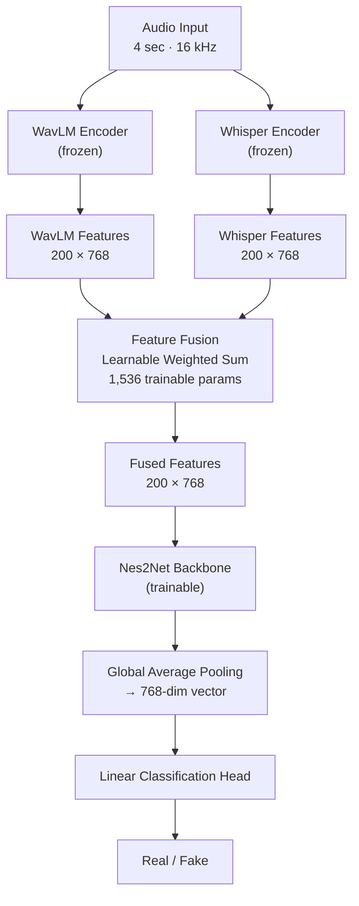

# FusionGuardNet: Audio Deepfake Detection Using WavLM, Whisper, and Nes2Net

## Abstract

The rapid advancement of generative AI has made synthetic speech increasingly indistinguishable from natural human voice, posing serious threats to voice authentication systems and audio-based communication. This project presents **FusionGuardNet**, an audio deepfake detection system that combines complementary representations from two large pre-trained models — **WavLM** and **Whisper** — processed by a **Nes2Net** classifier.

WavLM captures fine-grained acoustic and speaker-level properties of the audio signal, while Whisper encodes phonetic and prosodic structure derived from its speech recognition training. Both encoders are kept fully frozen, and their 768-dimensional frame-level embeddings are combined through a lightweight learnable weighted fusion layer before being passed to the classifier. This offline extraction strategy eliminates redundant encoder inference during training and keeps the system practical on a single GPU.

FusionGuardNet is evaluated on two benchmark configurations. On **Dataset 1** (ASVspoof Combined, 10,536 test samples), the model achieves **99.18% accuracy** with a perfectly symmetric error profile of 43 false positives and 43 false negatives. On **Dataset 2** (ASVspoof-FoR Extended, 17,467 test samples), it reaches **99.34% accuracy** and an **Equal Error Rate of 0.60%**, demonstrating that performance remains stable under a broader and more diverse set of spoofing conditions.

The results support the central hypothesis that fusing acoustic and phonetic-linguistic representations yields a more robust detector than either modality alone, while introducing only 1,536 additional trainable parameters over the single-encoder baseline.

---

## Table of Contents

- [1. Introduction](#1-introduction)
  - [1.1 Challenges in Audio-Based Deepfake Detection](#11-challenges-in-audio-based-deepfake-detection)
  - [1.2 Project Goals: Improving Spoofing Classification Using Pre-trained Models](#12-project-goals-improving-spoofing-classification-using-pre-trained-models)
  - [1.3 Our Contribution: Integrating Whisper with WavLM in the Nes2Net Architecture](#13-our-contribution-integrating-whisper-with-wavlm-in-the-nes2net-architecture)
- [2. Related Work](#2-related-work)
  - [2.1 From Classical Methods to Pre-trained Representations](#21-from-classical-methods-to-pre-trained-representations)
  - [2.2 Classification Architecture: Nes2Net](#22-classification-architecture-nes2net)
- [3. Dataset and Preprocessing](#3-dataset-and-preprocessing)
  - [3.1 The Selected Datasets](#31-the-selected-datasets)
  - [3.2 Dataset Configurations](#32-dataset-configurations)
  - [3.3 Data Splitting](#33-data-splitting)
- [4. System Architecture and Proposed Methodology](#4-system-architecture-and-proposed-methodology)
  - [4.1 End-to-End System Overview](#41-end-to-end-system-overview)
  - [4.2 Audio Signal Preprocessing](#42-audio-signal-preprocessing)
  - [4.3 Acoustic and Semantic Feature Extraction: WavLM and Whisper](#43-acoustic-and-semantic-feature-extraction-wavlm-and-whisper)
  - [4.4 Feature Fusion: Combining WavLM and Whisper](#44-feature-fusion-combining-wavlm-and-whisper)
  - [4.5 Classification Model: Adapting Nes2Net to the Fused Features](#45-classification-model-adapting-nes2net-to-the-fused-features)
  - [4.6 Feature Dimensions and Architectural Comparison](#46-feature-dimensions-and-architectural-comparison)
- [5. Experimental Setup](#5-experimental-setup)
  - [5.1 Environment and Software Libraries](#51-environment-and-software-libraries)
  - [5.2 Training Procedure](#52-training-procedure)
  - [5.3 Hyperparameter Tuning](#53-hyperparameter-tuning)
  - [5.4 Evaluation Metrics](#54-evaluation-metrics)
- [6. Results and Discussion](#6-results-and-discussion)
  - [6.1 Baseline Model Performance: WavLM + Nes2Net](#61-baseline-model-performance-wavlm--nes2net)
  - [6.2 Enhanced Model Performance: WavLM + Whisper + Nes2Net](#62-enhanced-model-performance-wavlm--whisper--nes2net)
  - [6.3 Ablation Study: Relative Contribution of Whisper Integration](#63-ablation-study-relative-contribution-of-whisper-integration)
  - [6.4 Error Analysis: Strengths and Weaknesses Across Spoofing Types](#64-error-analysis-strengths-and-weaknesses-across-spoofing-types)
- [7. Conclusion and Future Work](#7-conclusion-and-future-work)
  - [7.1 Summary of Achievements in Model Integration](#71-summary-of-achievements-in-model-integration)
  - [7.2 Suggestions for Improvement and Future Research](#72-suggestions-for-improvement-and-future-research)
- [8. References](#8-references)
- [9. Glossary](#9-glossary)

---

## 1. Introduction

### 1.1 Challenges in Audio-Based Deepfake Detection

Recent advances in generative AI have made it significantly easier to produce synthetic speech that sounds indistinguishable from a real human voice [1][2]. Modern text-to-speech (TTS) and voice conversion (VC) systems can now generate highly convincing audio with minimal input, enabling an attacker to clone a speaker's voice from only a short recording [3]. As these technologies continue to improve, the boundary between authentic and synthetic speech becomes increasingly difficult to identify using human perception alone [1][3].

These audio deepfakes pose a growing security threat [4][5]. They can be used to bypass voice authentication systems, impersonate individuals in phone calls, manipulate financial transactions through social engineering, or spread disinformation through fabricated recordings. High-profile cases of voice-cloned fraud and AI-generated audio content shared on social media have already demonstrated the real-world impact of this technology [6], and as synthesis tools become more accessible, the scale of the threat is expected to grow. The risk is especially significant because audio is often treated as a trusted communication channel in banking, customer service, journalism, legal evidence, and personal communication [4][5].

Unlike visual deepfakes, which may sometimes reveal artifacts through inconsistent lighting, unnatural facial motion, or visible distortions, audio deepfakes can be harder to verify without specialized tools [1][2]. A short phone call or voice message may contain only limited acoustic information, and the listener usually has no direct access to the recording conditions, the speaker's real voice, or the synthesis process. This makes automatic detection systems an important component in protecting voice-based systems and reducing the misuse of synthetic speech [1][3].

The research community has responded to this challenge through the ASVspoof challenge series [7][8][9], which has run since 2015 and provides standardized benchmarks and evaluation protocols for anti-spoofing systems. Each edition introduces newer and more sophisticated spoofing systems, reflecting the ongoing arms race between generation and detection. These benchmarks have played an important role in moving the field from isolated experiments toward more comparable and reproducible evaluation settings.

Building an effective detector is not straightforward. Classical approaches relied on handcrafted audio features designed for tasks like speech recognition [10], and they tend to miss the subtle artifacts that modern synthesis methods introduce [1][2]. A deeper issue is generalization: a model trained to detect one type of fake audio may fail entirely when faced with a different synthesis method it has not seen before [11]. This is a major practical limitation, because real-world attacks are unlikely to match exactly the same algorithms, speakers, microphones, or recording conditions that appear in the training data.

Fake audio can fail in more than one dimension simultaneously [1][2]. Some artifacts are acoustic, such as unnatural spectral patterns, phase inconsistencies, or small irregularities in the waveform [1][2]. Other artifacts are phonetic or prosodic, such as irregular rhythm, unnatural intonation, weak co-articulation between phonemes, or speech patterns that sound fluent but do not fully match natural human production [12][13]. A detector that relies on a single feature type is therefore vulnerable to synthesis systems that do not happen to trigger that specific artifact.

In practice, new generation tools appear frequently, and many of them are designed to reduce the very artifacts that older detectors learned to recognize [14][11]. This means that a detector that only works on known attack types offers limited real-world protection. A more reliable system should be able to capture several complementary aspects of speech, so that it can still detect manipulated audio even when one category of evidence becomes less obvious.

Our project addresses this challenge by exploring how combining different types of pre-trained audio representations can produce a more robust and accurate deepfake detector. Instead of relying on one representation alone, we investigate whether acoustic and phonetic-linguistic information can support each other and provide a broader view of the input signal.

### 1.2 Project Goals: Improving Spoofing Classification Using Pre-trained Models

The main goal of this project is to build a system that can reliably distinguish between real and synthetic speech, and to validate it on two established public benchmark configurations. Rather than designing handcrafted features or training a model from scratch, we chose to leverage large pre-trained models [15][16] that have already learned rich representations of natural speech from massive amounts of audio data.

Our reasoning is that these representations capture patterns in speech that are far more informative than simple acoustic features [17][18], and that a classifier built on top of them will be better equipped to detect the subtle inconsistencies introduced by fake audio [19][20][21]. Pre-trained speech models [17] are exposed during training to diverse speakers, accents, recording conditions, and linguistic patterns. As a result, their internal representations can encode useful information about what natural speech normally looks and sounds like, even before they are adapted to a specific downstream task.

A key design decision in this project is the use of **offline feature extraction**. Rather than running the large pre-trained encoders during each training step, we extract and save all audio representations to disk before training begins. This cleanly separates the costly encoding step from the iterative training loop, dramatically reduces GPU memory pressure, and makes it practical to experiment with different classifier architectures and hyperparameters without re-running inference through multi-hundred-million-parameter models.

This separation also improves the clarity of the pipeline. The feature extraction stage is responsible for converting raw audio into high-level representations, while the training stage focuses only on learning how to combine and classify these representations. This makes the system easier to debug, easier to reproduce, and more suitable for experimentation under limited computational resources.

Beyond using a single pre-trained model, a central goal was to explore whether combining two models with different strengths could improve detection further. Different types of synthesis errors leave different traces in the audio [1][2]: some are more signal-level, while others relate to how speech is structured at a phonetic or rhythmic level. By giving the classifier a richer, multi-perspective view of the input, we aimed to improve both accuracy and robustness.

The end result is a complete, working detection pipeline that we train and evaluate across two dataset configurations. The first configuration combines two standard benchmarks: **ASVspoof 2019 LA** [7] and **ASVspoof5 (2024)** [8]. The second configuration extends this with a third dataset, **Fake-or-Real (for-norm)** [22], adding additional diversity in recording conditions and synthesis methods not present in the ASVspoof corpora. This allows us to test the model not only on a controlled benchmark setting, but also on a broader mixed-source setting that better reflects the variety of synthetic speech found in practice.

We then compare the proposed approach against single-encoder baselines conceptually and architecturally, with the main focus on evaluating whether the fused representation provides a stronger foundation for classification than relying on only one source of information. The project therefore aims not only to achieve high detection accuracy, but also to examine whether feature-level integration is a useful direction for improving audio deepfake detection systems.

### 1.3 Our Contribution: Integrating Whisper with WavLM in the Nes2Net Architecture

Our main contribution is the design and implementation of **FusionGuardNet**, a detection system that combines two pre-trained models: **WavLM** [15] and **Whisper** [16]. These models extract complementary representations from the same audio input, allowing the system to analyze the signal from two different perspectives before making the final decision.

WavLM [15] is a self-supervised acoustic model trained on large amounts of raw speech. It captures low-level signal patterns and spectral characteristics that reflect how the voice sounds at the waveform level. This makes it useful for identifying artifacts that appear directly in the acoustic structure of the signal, such as unnatural frequency behavior, distortions, or inconsistencies in speaker-related characteristics.

Whisper [16], originally built for automatic speech recognition, brings a different perspective by encoding phonetic and prosodic information, capturing how speech is structured at a linguistic level. Since Whisper is trained to understand spoken content across a wide range of speakers and recording conditions, its encoder representations can reflect higher-level speech organization, including phoneme transitions, rhythm, and speaking patterns. These properties are relevant because synthetic speech may sound acoustically smooth while still containing subtle irregularities in timing, pronunciation, or linguistic flow [12][13].

Both representations are extracted offline, combined through a learnable weighted fusion layer, and passed into a shared **Nes2Net** [33] classifier, which produces the final real/fake decision. The fusion layer learns how much to rely on each representation for each feature dimension, rather than forcing a fixed manual combination. This allows the model to adaptively balance acoustic evidence from WavLM with phonetic-linguistic evidence from Whisper.

The motivation behind this design is that synthetic speech can fail in more than one way [1][2]. Some artifacts are acoustic, while others are phonetic [12][13]. Combining two models that analyze the signal differently gives the system a better chance of detecting both [23][24]. If one representation is less sensitive to a specific type of fake audio, the other representation may still contain useful information that helps the classifier reach the correct decision.

A further architectural choice is that the two pre-trained encoders are kept fully frozen throughout training. Only the fusion layer and the Nes2Net backbone are updated. This keeps the trainable parameter count small, prevents catastrophic forgetting of the rich representations learned during large-scale pre-training, and makes the full system practical to train in a small number of epochs on a single GPU. This is important because fine-tuning large encoders directly would require significantly more memory, longer training time, and a higher risk of overfitting to the specific datasets used in the project.

Another contribution of the system is the preservation of a compact and consistent feature shape throughout the pipeline. WavLM [15] and Whisper [16] both produce 768-dimensional feature representations, and after temporal alignment the two sequences can be fused without adding a large projection module or increasing the input dimension of the classifier. This means that the proposed architecture adds a second source of information while keeping the downstream Nes2Net interface stable and efficient.

We evaluate FusionGuardNet across two dataset configurations. On **Dataset 1** (**ASVspoof Combined (ASVsp-C)**), containing 10,536 balanced test samples, the model achieves **99.18% test accuracy**, with a test loss of **0.0324** and only **86 misclassifications**. The error profile is perfectly symmetric, with equal false positive and false negative rates:

**Table 1: FusionGuardNet test results summary on the ASVspoof Combined dataset (Dataset 1).**

| Metric | Value |
|---|---:|
| Test samples | 10,536 |
| Test accuracy | 99.18% |
| F1-score (fake) | 99.18% |
| Test loss | 0.0324 |
| Total mistakes | 86 |
| True negatives (TN) | 5,225 |
| False positives (FP) | 43 |
| False negatives (FN) | 43 |
| True positives (TP) | 5,225 |

This result indicates that the model performs consistently across both real and fake samples, without showing a strong bias toward one class. The equal number of false positives and false negatives suggests that the decision boundary is well balanced for this dataset configuration.

On **Dataset 2** (**ASVspoof-FoR Extended (ASVsp-FoR)**), containing 17,467 test samples, FusionGuardNet achieves **99.34% test accuracy** with an **Equal Error Rate (EER) of 0.60%**, demonstrating that the performance gains hold across a more diverse and modern set of spoofing conditions. Since Dataset 2 includes an additional independently sourced corpus, this result is especially important because it suggests that the fused architecture remains stable when the data becomes more varied.

Both configurations show strong performance for the fused architecture. A fully documented numerical baseline table, including WavLM-only and Whisper-only settings, is planned separately to complete direct performance attribution. This will make it possible to isolate the contribution of each branch more precisely and further validate the role of feature fusion in improving robustness.

---

## 2. Related Work

### 2.1 From Classical Methods to Pre-trained Representations

In the context of speaker verification and audio authenticity systems, **spoofing** refers to the deliberate use of synthesized, replayed, or voice-converted speech to deceive an automatic system into accepting it as genuine. A spoofed sample may be produced by a text-to-speech (TTS) engine, a voice conversion (VC) model, or a replay of a real speaker's recording. The goal is typically to impersonate another person, bypass a voice-based security check, or introduce false evidence. Detecting such attacks — distinguishing real from fake audio — is the central objective of the systems discussed throughout this work.

Early anti-spoofing systems relied on handcrafted audio features [10] combined with classical machine learning classifiers. These methods captured broad spectral properties of the audio and worked reasonably well against the synthesis systems of their time, which left relatively obvious acoustic traces. As neural speech synthesis improved and produced more natural-sounding output [1][3], however, these approaches became insufficient - their fixed representations were not sensitive enough to capture the subtle differences between real and synthetic speech. The field gradually moved toward deep learning [2], which allowed models to learn more discriminative patterns directly from data rather than relying on manually designed features.

The most recent and effective direction has been the use of large self-supervised models pretrained on vast amounts of natural speech [1][18]. These models produce rich audio representations that capture general properties of human speech and have been shown to generalize better to new and unseen synthesis methods [11][25]. Two such models form the backbone of our approach: WavLM [15] and Whisper [16].

WavLM [15] is a self-supervised speech model developed by Microsoft and trained on a large and diverse corpus of audio data. During training, it learns to reconstruct masked portions of the audio signal from noisy and clean speech [15], forcing it to develop a deep understanding of how natural speech is structured at the acoustic level. It was originally designed to perform well across a wide range of speech tasks, including speaker recognition and speech separation [17], and achieves strong results on many of them without task-specific fine-tuning. For deepfake detection, its key value is that it captures fine-grained acoustic properties that tend to deviate from natural patterns when audio is synthetically generated [19][20][21]. Architecturally, WavLM is built on the wav2vec 2.0 framework [26], using a CNN-based waveform encoder followed by a stack of Transformer layers. What distinguishes it from predecessors such as HuBERT [27] or wav2vec 2.0 [26] is its training objective: rather than simply masking and predicting clean speech tokens, WavLM is trained with a masked speech prediction task applied to speech mixed with noise or overlapping utterances [15], forcing the model to learn representations that are robust to signal-level perturbations. The variant we use, **microsoft/wavlm-base-plus**, produces frame-level embeddings of dimension **768** at a temporal resolution of one frame per **20 ms** [15], preserving the fine temporal structure needed to detect brief synthesis artifacts at specific time steps. Its strong speaker-discriminative properties make it especially sensitive to the acoustic fingerprint of a speaker [15], which voice-conversion and TTS systems must approximate but rarely replicate perfectly.

![Figure 2: WavLM pre-training architecture. The model uses CNN encoders to extract local features from raw audio, followed by a Transformer encoder with Gated Relative Position Bias. During training, a subset of frames is masked ([M]) and the model is trained to predict the target representations Z from the unmasked context, using a Mask Prediction Loss. This self-supervised objective over noise-mixed speech forces the model to build robust acoustic representations.](figures/wavlm_architecture.png)

*Figure 2: WavLM pre-training architecture — masked prediction over utterance-mixed audio with CNN encoder and Transformer stack [15].*

Whisper [16], developed by OpenAI, takes a fundamentally different approach. It is an automatic speech recognition model trained on 680,000 hours of transcribed audio from diverse sources across the internet [16]. Because its objective is to accurately transcribe spoken content, it learns to encode phonetic and linguistic structure [16] - how speech sounds are organized into words, syllables, and sentences - rather than raw acoustic signal properties. While Whisper was not designed for deepfake detection, this perspective is directly relevant [28]: synthetic speech often contains subtle phonetic irregularities and unnatural prosodic patterns that acoustic models may overlook. Architecturally, Whisper follows an encoder-decoder design [16]; the encoder receives a log-Mel spectrogram and processes it through Transformer layers to build higher-level representations of phoneme sequences, coarticulation patterns, and prosodic contours, while the decoder - which generates text tokens - is discarded entirely in our pipeline. The variant we use, **openai/whisper-small**, also produces frame-level embeddings of dimension **768** [16], matching WavLM exactly. This dimensional alignment means the two sequences can be combined without an additional projection layer. Because Whisper has been exposed to a wide range of voices, accents, and speaking styles, its encoder has developed a robust internal model of what phonetically plausible speech should look like; deviations from this model, such as those introduced by TTS systems that imperfectly model coarticulation or rhythm, can appear as anomalous activation patterns that a downstream classifier can exploit [28]. Together, WavLM and Whisper offer complementary views of the same audio signal - one acoustic, one phonetic - which is the core idea behind our fusion approach [23][24].

*Figure 3: Whisper encoder-decoder architecture [16]. Only the encoder (left) is used in FusionGuardNet; the decoder is discarded after feature extraction.*

### 2.2 Classification Architecture: Nes2Net

Once the complementary representations from WavLM and Whisper are extracted, the task of integrating and classifying them falls to the Nes2Net architecture. To understand it, it helps to trace the line of architectures it builds on.

Standard ResNet [29] introduced residual connections: shortcut paths that add the input of a block directly to its output. These connections allow gradients to flow cleanly through deep networks and made it practical to train much deeper models without degradation. Res2Net [30] extended this idea by splitting the feature channels within a single residual block into multiple subsets and processing them in a hierarchical, sequential manner, letting the block naturally capture features at multiple scales in a single forward pass. This multi-scale property is useful for audio because spoofing artifacts can appear at different time resolutions [31][32] - a model that can attend to both local frame-level irregularities and broader temporal patterns in one block is better equipped to detect them.

Nes2Net [33], proposed by Liu et al. (2025), nests an additional residual connection inside each Res2Net block, creating a two-level hierarchy of residual pathways within a single building block. The inner shortcut preserves fine-grained information while the outer one propagates coarser, more abstract representations, giving the architecture greater expressive capacity without requiring more depth or more parameters. Each block also incorporates a Squeeze-and-Excitation (SE) module, which recalibrates the importance of each feature channel using global context, further improving the model's ability to focus on the most informative parts of the representation. A key practical advantage is that Nes2Net is designed to accept the high-dimensional output of speech foundation models directly, without a dimensionality reduction step that would inevitably discard information. A global pooling operation at the end of the backbone collapses the temporal dimension into a fixed-length vector, which is then passed to a linear classification head. For FusionGuardNet, this architecture serves as a compact but expressive engine that processes the fused WavLM and Whisper embeddings and produces the final real/fake decision.

---

## 3. Dataset and Preprocessing

### 3.1 The Selected Datasets

We conducted experiments on two dataset configurations of increasing scale. The first configuration, **Dataset 1**, combines two standard ASVspoof benchmarks. The second configuration, **Dataset 2**, extends the first by adding a third, independently sourced corpus.

The three source datasets are described below.

#### ASVspoof 2019 Logical Access (LA)

ASVspoof 2019 LA [7] is one of the most widely adopted benchmarks in the speech anti-spoofing field. It contains recordings generated by 19 different text-to-speech and voice-conversion algorithms, alongside genuine human speech samples collected in a controlled recording environment.

The audio is distributed in FLAC format with accompanying protocol files that map each utterance ID to a label, either **bonafide** or **spoof**, and a source system identifier. Using this dataset allows direct comparison with a large body of prior work.

**Format and size:** The audio files are in FLAC format. The complete corpus spans three official splits (train, development, evaluation) and includes 2,580 bonafide training utterances alongside spoofed samples generated by 19 synthesis systems (labeled A01–A19). We pool all available splits and re-partition them in our pipeline (see Section 3.3).

#### ASVspoof5 (2024)

ASVspoof5 [8] is the most recent release in the ASVspoof series. It was collected under more challenging and diverse conditions, with a broader range of modern synthesis systems representing the current state of generative speech technology.

Including it alongside the 2019 data exposes the model to a wider variety of spoofing artifacts, which supports better generalization. It is also distributed in FLAC format with protocol files covering train and dev splits.

**Format and size:** Audio is distributed in FLAC format across multiple subdirectories. The corpus includes crowdsourced data alongside synthetically generated speech from a broad range of modern TTS and VC systems. Protocol TSV files covering train and dev splits are used for label assignment.

#### Fake-or-Real (for-norm subset)

Fake-or-Real [22] is a publicly available dataset released on Kaggle, comprising real recordings and AI-generated speech samples. We use only the **for-norm** folder from this collection, which contains studio-quality, noise-normalized samples.

Unlike the ASVspoof corpora, which are organized around specific spoofing systems and protocol files, this dataset provides additional diversity in recording conditions and synthesis methods. This reduces the risk of the model overfitting to ASVspoof-specific artifacts.

The audio files are provided in WAV format and are read directly without a protocol file. Class membership is inferred from the folder structure.

**Format and size:** Audio files are in WAV format. The for-norm subset provides studio-quality, noise-normalized recordings in two balanced class folders (real and fake). This subset contributes approximately 69,300 samples to Dataset 2 (roughly 34,650 real and 34,650 fake), introducing additional diversity in recording conditions and synthesis methods not present in the ASVspoof corpora.

### 3.2 Dataset Configurations

Our data organization pipeline reads the protocol files for all available ASVspoof splits and the folder structure of the Fake-or-Real subset. It then merges the entries into a unified pool before re-splitting.

**Table 2: Dataset configurations used in this project.**

| Configuration | Name | Included datasets |
|---|---|---|
| Dataset 1 | ASVspoof Combined (ASVsp-C) | ASVspoof 2019 LA + ASVspoof5 2024 |
| Dataset 2 | ASVspoof-FoR Extended (ASVsp-FoR) | ASVspoof 2019 LA + ASVspoof5 2024 + Fake-or-Real (for-norm) |

Throughout this document, **Dataset 1** is referred to as **ASVspoof Combined (ASVsp-C)** and **Dataset 2** as **ASVspoof-FoR Extended (ASVsp-FoR)**.

### 3.3 Data Splitting

After collecting all entries for a given configuration and matching each utterance ID against the available audio files, the merged pool is split into train, validation (dev), and test sets using an **80 / 10 / 10** ratio.

Class balance is enforced at the split level. Real and fake entries are shuffled independently using random seed **42** for reproducibility, and the same number of samples is drawn from each class for every split. This guarantees that no split is skewed toward either class, and that the evaluation metrics reflect genuine discriminative performance rather than class prior.

The actual dataset sizes used in our experiments were as follows:

**Table 3: Sample counts by dataset configuration, split, and class.**

| Configuration | Split | Real | Fake | Total |
|---|---|---:|---:|---:|
| Dataset 1 | Train | 42,139 | 42,139 | 84,278 |
| Dataset 1 | Dev | 5,267 | 5,267 | 10,534 |
| Dataset 1 | Test | 5,268 | 5,268 | 10,536 |
| Dataset 2 | Train | 69,823 | 69,895 | 139,718 |
| Dataset 2 | Dev | 8,727 | 8,736 | 17,463 |
| Dataset 2 | Test | 8,729 | 8,738 | 17,467 |

Dataset 1 contains **105,348** samples in total. Dataset 2 contains **174,648** samples, with the additional approximately **69,300** samples contributed by the Fake-or-Real (for-norm) subset. The slight real/fake imbalance in Dataset 2 reflects the natural composition of the Fake-or-Real data, though the difference is small, less than 0.1%, and does not materially affect training.

The pipeline also produces a protocol file and a summary file for each split, recording each utterance's ID, class label, source dataset, and original split. This facilitates traceability and later analysis.

---

## 4. System Architecture and Proposed Methodology

### 4.1 End-to-End System Overview

FusionGuardNet follows a three-stage pipeline with clear stage separation.

**Table 4: FusionGuardNet three-stage processing pipeline.**

| Stage | Description | Output |
|---|---|---|
| 1. Offline feature extraction | Each audio clip is preprocessed and passed through frozen WavLM and Whisper encoders. | Saved PyTorch tensor files |
| 2. Feature fusion | The two pre-extracted feature sequences are loaded and combined by a learnable fusion module. | One fused feature sequence |
| 3. Classification | The fused sequence is passed through the Nes2Net backbone and classified as real or fake. | Two-class prediction |

Before training, each audio clip is preprocessed and passed through two frozen pre-trained encoders: WavLM and Whisper. Their output feature sequences are saved to disk as PyTorch tensor files. This happens once and is not repeated during training.

At training and inference time, the two pre-extracted feature sequences for a given clip are loaded from disk and combined by a small learnable module. The output is a single fused feature sequence of the same temporal shape as each individual input.

The fused sequence is then passed through the Nes2Net backbone, which processes it with a stack of multi-scale residual blocks, reduces the temporal dimension through global pooling, and produces a two-class output: real or fake.

The key architectural choice across all three stages is that the two pre-trained encoders are never fine-tuned. Their weights are frozen throughout. The only components that are trained are the fusion layer and the Nes2Net backbone. This keeps the number of trainable parameters small, prevents catastrophic forgetting, and makes it feasible to train the full system in a small number of epochs.

**Figure 1: FusionGuardNet architecture — dual-encoder offline feature extraction, learnable fusion, and Nes2Net classification.**

### 4.2 Audio Signal Preprocessing

Before feature extraction, each audio clip goes through the same normalization pipeline, applied uniformly across all source datasets.

**Table 5: Audio preprocessing steps applied uniformly across all source datasets.**

| Step | Description |
|---|---|
| Channel reduction | Multi-channel recordings are averaged into a single mono waveform. |
| Sample rate normalization | Every waveform is resampled to 16,000 Hz using Torchaudio. |
| Fixed-length normalization | Each waveform is normalized to exactly 4 seconds, equal to 64,000 samples. |
| Padding-validity mask | A frame-level binary mask marks real audio frames as 1 and padded frames as 0. |

#### Channel reduction

If a recording contains more than one channel, the channels are averaged into a single mono waveform. This matches the expected single-channel input format of the pre-trained encoders used in this project.

#### Sample rate normalization

Every waveform is resampled to **16,000 Hz** using Torchaudio. This is the expected input rate for both WavLM and the Whisper encoder.

#### Fixed-length normalization

To ensure consistent input dimensions across all samples, each waveform is normalized to exactly **4 seconds** (**64,000 samples**).

Clips longer than 4 seconds are randomly cropped. A start offset is drawn uniformly at random from the valid range, and 64,000 consecutive samples are taken from that position. This random crop acts as a mild data augmentation. Clips shorter than 4 seconds are zero-padded at the end to reach the target length.

#### Padding-validity masking

For each clip, we record the ratio of real (non-padded) samples to total length. This ratio is used to build a frame-level binary mask after feature extraction. Frames corresponding to real audio are marked **1**, while frames corresponding to padding are marked **0**. The mask is stored alongside the features and can be passed to the classifier to reduce attention to padding artifacts.

### 4.3 Acoustic and Semantic Feature Extraction: WavLM and Whisper

Rather than extracting features on the fly during training, both WavLM and Whisper representations are computed once for all clips and saved as PyTorch tensor files (`.pt`).

Each saved file contains:

- WavLM feature sequence
- Whisper encoder feature sequence, temporally aligned to WavLM
- WavLM and Whisper padding-validity masks
- Integer label: `0` for real, `1` for fake
- Metadata (when enabled in the extraction script): source path, split name, class name, sample rate, and duration

This offline approach avoids redundant forward passes through large pre-trained models during training and significantly reduces GPU memory pressure.

#### WavLM extraction

The preprocessed 16 kHz mono waveform is passed directly into the frozen WavLM encoder, **microsoft/wavlm-base-plus**. The model processes the raw waveform through its CNN feature extractor and Transformer stack, producing a sequence of **768-dimensional** frame-level embeddings at a temporal resolution of one frame per **20 ms**.

For a 4-second clip, this results in a sequence of **200 frames**, which becomes the fixed temporal length used throughout the pipeline.

#### Whisper extraction

The same waveform is first converted to an **80-band log-Mel spectrogram**, the required input format for the Whisper encoder. The spectrogram is passed through the frozen Whisper encoder, **openai/whisper-small**. The decoder is not used.

The encoder outputs a sequence of **768-dimensional** contextual embeddings that reflect phonetic and prosodic structure rather than raw acoustic signal properties.

*Figure 4: Log-Mel spectrograms of a real (left) and fake (right) audio sample. Synthetic speech exhibits smoother, more uniform energy distributions compared to the denser, more variable patterns in natural speech.*

#### Temporal alignment

WavLM and Whisper produce feature sequences of different temporal lengths for the same 4-second input. After extracting both, the Whisper sequence is aligned to the WavLM sequence length. If Whisper produces more frames, it is truncated. If it produces fewer frames, it is zero-padded at the end.

This alignment ensures that the two sequences share a common time axis and can be combined frame-by-frame in the fusion stage.

### 4.4 Feature Fusion: Combining WavLM and Whisper

The fusion module takes two temporally aligned feature sequences, each of shape **T × 768**, and combines them into a single sequence of the same shape. This fused representation is then passed to the classifier.

The fusion is implemented as a **learnable weighted sum**. A vector of **768 scalar weights** is maintained for each of the two input sources. Before combining, these weights are passed through a softmax so they sum to 1 across the two sources at every feature dimension.

At each time step, the fused output is a convex combination of the WavLM and Whisper embeddings, where the mixing proportion for each feature dimension is learned during training.

This formulation is intentionally simple:

- It adds only **2 × 768 = 1,536** trainable parameters.
- It imposes no structural assumptions about how the two representations should interact.
- It is interpretable, because the learned weights reveal which model the classifier relies on for each part of the feature space.

### 4.5 Classification Model: Adapting Nes2Net to the Fused Features

The fused **T × 768** sequence is passed to the Nes2Net backbone without dimensionality reduction. Each Nes2Net block receives the full 768-dimensional representation and processes it through its nested Bottle2neck structure and SE module. This progressively refines the representation while preserving both fine-grained and coarser-scale information across the temporal dimension.

After the stack of Nes2Net blocks, global average pooling collapses the temporal dimension **T** into a single **768-dimensional** vector that summarizes the clip. This vector is then passed to a linear classification head that produces two logits, corresponding to the real and fake classes.

During training, cross-entropy loss is applied to these logits. At inference time, the argmax of the logits determines the final prediction.

The input dimension of 768 matches the output of both pre-trained encoders exactly, so no projection layer is needed between the fusion module and the classifier. The NES ratio is set to **(8, 8)** and the dilation factor to **2** within the Bottle2neck blocks, matching the configuration from the original Nes2Net paper [33]. A dropout rate of **0.5** is applied within the backbone during training for regularization.

### 4.6 Feature Dimensions and Architectural Comparison

To make tensor sizes and architectural transitions explicit, This table summarizes the exact dimensions used from raw input to classifier output.

**Table 6: Tensor dimensions at each processing stage of FusionGuardNet.**

| Component | Output shape / size | Explanation |
|---|---:|---|
| Input audio | 64,000 samples | 4 seconds at 16 kHz |
| WavLM features | 200 × 768 | Frame-level embeddings, ~20 ms stride |
| Whisper features (before alignment) | variable × 768 | Encoder embeddings from log-Mel spectrogram input |
| Whisper features (after alignment) | 200 × 768 | Truncated or zero-padded to the WavLM temporal length |
| Fusion input | two tensors of 200 × 768 | WavLM branch + Whisper branch |
| Fusion output | 200 × 768 | Channel-wise weighted combination |
| Fusion trainable parameters | 1,536 | 2 learnable weights per 768 channels |
| Nes2Net input | 200 × 768 | Fused sequence; no projection layer required |
| Global pooling output | 768 | Temporal axis collapsed by mean pooling |
| Classification output | 2 logits | Real / fake |

Relative to the baseline architecture, the core change is the addition of the Whisper branch before classification. In the baseline setting, Nes2Net receives a single **200 × 768** WavLM tensor. In the proposed setting, a second aligned **200 × 768** Whisper tensor is fused with WavLM through a learnable weighted sum, while preserving the classifier input shape at **200 × 768**. This keeps the downstream Nes2Net interface unchanged and introduces only **1,536** additional trainable parameters in the fusion layer.

## 5. Experimental Setup

### 5.1 Environment and Software Libraries

All experiments were run on a CUDA-enabled GPU, with automatic fallback to CPU when a GPU was unavailable.

The project is implemented in Python using PyTorch as the main deep learning framework, with Torchaudio for audio loading and resampling. We used the Hugging Face Transformers library to load the pre-trained WavLM and Whisper models.

Additional libraries include NumPy and Pandas for data handling, scikit-learn for evaluation metrics, and Matplotlib and Seaborn for result visualization.

### 5.2 Training Procedure

We trained the model using the Adam optimizer with a learning rate of **1e-4** and a weight decay of **1e-4** for L2 regularization. The loss function used is standard Cross-Entropy Loss, which is well suited for our binary classification task: real versus fake.

To improve training stability, we applied gradient clipping with a maximum norm of **1.0**. We also used a ReduceLROnPlateau scheduler that halves the learning rate when validation loss does not improve for **2 consecutive epochs**.

Training ran for a total of **8 epochs** with a batch size of **16**, and we applied early stopping with a patience of **4 epochs** to avoid overfitting. The best model checkpoint was saved based on the best combination of validation accuracy and validation loss.

To ensure reproducibility, we fixed the random seed to **42** for PyTorch and the Python random module.

### 5.3 Hyperparameter Tuning

The main architectural hyperparameters of the Nes2Net classifier were kept consistent with the original design.

**Table 7: Hyperparameter configuration used for all training runs.**

| Hyperparameter | Value |
|---|---:|
| Input feature dimension | 768 |
| NES ratio | (8, 8) |
| Dilation factor | 2 |
| Dropout rate | 0.5 |
| Pooling | Global average pooling |
| Audio sample rate | 16,000 Hz |
| Audio duration | 4 seconds |
| Samples per clip | 64,000 |
| Temporal sequence length | 200 frames |
| Fusion type | Learnable weighted sum |
| WavLM model | microsoft/wavlm-base-plus |
| Whisper model | openai/whisper-small |

The fusion module uses a learnable weighted sum with softmax normalization over the two feature sources, allowing the model to learn how much to rely on WavLM versus Whisper at each feature dimension.

### 5.4 Evaluation Metrics

We evaluated the model using several complementary metrics.

**Table 8: Evaluation metrics used in this project.**

| Metric | Purpose |
|---|---|
| Accuracy | Measures the overall percentage of correctly classified samples. |
| Cross-Entropy loss | Tracks convergence and helps detect overfitting. |
| Precision | Measures how reliable positive predictions are. |
| Recall | Measures how many samples of a class are correctly detected. |
| F1-score | Harmonic mean of precision and recall. |
| Equal Error Rate (EER) | Measures the point where false acceptance and false rejection rates are equal. |

Because Dataset 1 is perfectly balanced and Dataset 2 is near-balanced (with a very small class skew), accuracy serves as a reliable primary metric in both experiments. However, accuracy alone is not sufficient. The confusion matrix, precision, recall, and F1-score reveal whether the model tends to miss fake samples or incorrectly flag real ones.

All metrics are computed after running inference in evaluation mode, with dropout disabled and no gradient updates, across the full test set.

---

## 6. Results and Discussion

### 6.1 Baseline Model Performance: WavLM + Nes2Net

The baseline configuration was designed as an acoustic-only setting, where WavLM representations are directly processed by the Nes2Net classifier.

This provides a controlled reference for the study by keeping the classification objective unchanged, while relying solely on signal-level information. As such, the baseline serves as the primary comparison point for assessing the added value of multimodal integration in the proposed framework, especially when discussing stability and generalization trends.

### 6.2 Enhanced Model Performance: WavLM + Whisper + Nes2Net

The enhanced configuration extends the baseline by integrating complementary representations from WavLM and Whisper prior to classification. By combining these sources at feature level, the model can jointly consider low-level acoustic signatures and higher-level linguistic patterns.

In this setting, the model benefits from both acoustic cues and higher-level phonetic-linguistic structure, with fusion performed through a learnable weighted mechanism before Nes2Net prediction. The adaptive weighting allows the network to emphasize whichever representation is more informative for each input condition.

The main quantitative results are summarized below.

**Table 9: Main quantitative results for FusionGuardNet (WavLM + Whisper + Nes2Net).**

| Experiment | Accuracy | Precision | Recall | F1-score | EER |
|---|---:|---:|---:|---:|---:|
| Dataset 1 | 99.18% | 99.18% | 99.18% | 99.18% | N/A |
| Dataset 2 | 99.34% | 99.12% | 99.57% | 99.35% | 0.60% |

For **Dataset 1**, FusionGuardNet was trained and evaluated after balanced split preparation (**84,278 train**, **10,534 dev**, **10,536 test**), with a near-symmetric error profile and only **86 total mistakes** (**TN=5,225, FP=43, FN=43, TP=5,225**). The training history showed stable convergence over 8 epochs, rising from **92.60%** train accuracy in epoch 1 to **99.49%** in epoch 8, with best dev accuracy of **99.25%**.

For **Dataset 2**, which adds the Fake-or-Real (for-norm) subset and therefore increases diversity and scale, the same architecture maintained strong performance on a larger test set (**17,467 samples**). The model reached **99.34% test accuracy**, **0.60% EER**, and confusion-matrix counts of **TN=8,652, FP=77, FN=38, TP=8,700**, indicating that the integration remains robust under broader and more modern spoofing conditions

Compared with the acoustic-only setup, this combined representation yields stronger and more stable performance behavior, supporting the central hypothesis that semantic-acoustic fusion improves robustness in deepfake speech detection. The observed behavior is consistent with the design goal of reducing dependence on any single cue family.

### 6.3 Ablation Study: Relative Contribution of Whisper Integration

The ablation logic in this project compares two aligned settings:

**Table 10: Ablation study comparing baseline and proposed model settings.**

| Setting | Feature source | Classifier |
|---|---|---|
| Baseline | WavLM only | Nes2Net |
| Proposed model | WavLM + Whisper | Nes2Net |

Because both settings keep the same classifier family and decision objective, the main changing factor is the addition of Whisper-derived information. This makes it possible to attribute the observed robustness gains to multimodal feature integration rather than to a different classification backend, which keeps the comparison methodologically clean.

In practical terms, the ablation analysis supports our core claim that adding semantic-phonetic context improves the model's ability to handle difficult cases that are less separable from acoustic cues alone. It also clarifies that the improvement is not merely a byproduct of model size, since the classification head remains conceptually consistent.

### 6.4 Error Analysis: Strengths and Weaknesses Across Spoofing Types

In Dataset 1, the final test run shows a symmetric error profile, with the same number of false positives and false negatives. In Dataset 2, the profile is slightly asymmetric (FP=77, FN=38), but still strongly balanced relative to the dataset size. Together, these outcomes indicate that the model does not strongly favor one class over the other across either experimental configuration.

Across both experiments, most predictions are highly confident, while the mistaken cases are concentrated around more ambiguous examples, including a subgroup near the decision boundary and another subgroup with high-confidence errors. This suggests that some errors come from genuinely borderline samples, while others likely reflect hard artifacts that still confuse both feature branches.

This pattern suggests two practical directions for improvement:

1. **Calibration-oriented techniques** to reduce overconfident mistakes.
2. **Targeted data expansion** for edge cases that remain difficult under both acoustic and semantic evidence.

Although the available exported files do not include explicit attack-type tags per sample, the current analysis still provides a useful diagnostic view of where the model is already stable and where it can be strengthened.

---

## 7. Conclusion and Future Work

### 7.1 Summary of Achievements in Model Integration

In this project, we implemented and validated a complete audio deepfake detection pipeline based on feature-level integration between two pre-trained backbones, WavLM and Whisper, followed by classification with a Nes2Net-based head. This end-to-end design keeps representation learning and final decision-making tightly coordinated in one workflow while keeping the frozen encoder strategy unchanged across experiments.

The detailed quantitative outcomes and their interpretation are reported in **Section 6 (Results and Discussion)**, in line with the standard structure where experimental findings are presented before the concluding chapter.

Taken together, the experiments show that the main achievement is not only combining acoustic and semantic representations in one architecture, but demonstrating that this combination trains reliably and scales well from the first configuration to the larger mixed-source configuration.

### 7.2 Suggestions for Improvement and Future Research

For future work, the first priority is to run a fully documented baseline suite using the same reporting format. This should include both **WavLM-only** and **Whisper-only** settings, so the contribution of each branch can be compared directly. A consistent baseline package will make future comparisons clearer and strengthen the reproducibility of conclusions.

Another important step is broader robustness evaluation on additional datasets and unseen generation settings, to check how well the model generalizes outside the current benchmark. This is especially important for understanding whether performance remains stable under distribution shifts and new synthesis artifacts.

On the modeling side, it is worth testing richer fusion strategies, such as attention-based fusion, and calibration methods that can reduce confident mistakes on borderline samples. These extensions could improve both detection reliability and confidence quality in challenging decision regions.

From a deployment perspective, improving runtime and memory efficiency can make the system more suitable for near-real-time screening. Lightweight inference behavior is likely to be a key requirement for practical integration into monitoring pipelines.

Finally, adding interpretability analysis for time-frequency regions can make decisions easier to explain and trust in practical, high-stakes applications. Better interpretability would also help researchers diagnose remaining failure modes and guide targeted data or architecture improvements.

---

## 8. References

1. Li, M., Ahmadiadli, Y., & Zhang, X.-P. (2024). *A Survey on Speech Deepfake Detection*. arXiv:2404.13914. https://arxiv.org/abs/2404.13914

2. Yi, J., Wang, C., Tao, J., Zhang, X., Zhang, C. Y., & Zhao, Y. (2023). *Audio deepfake detection: A survey*. arXiv:2308.14970. https://arxiv.org/abs/2308.14970

3. Li, X., Chen, P.-Y., & Wei, W. (2025). *Where are we in audio deepfake detection? A systematic analysis over generative and detection models*. ACM Transactions on Internet Technology, 25(3). https://arxiv.org/abs/2410.04324

4. Hong, M., Jiang, D., Xie, Z., Zhao, W., Wang, G., & Zhang, C. J. (2026). *Vulnerabilities of audio-based biometric authentication systems against deepfake speech synthesis*. arXiv:2601.02914. https://arxiv.org/abs/2601.02914

5. Kamel, K., Sood, K., Sankar Dutta, H., & Aryal, S. (2025). *A survey of threats against voice authentication and anti-spoofing systems*. arXiv:2508.16843. https://arxiv.org/abs/2508.16843

6. Chandra, N. A., Murtfeldt, R., Qiu, L., Karmakar, A., Lee, H., Tanumihardja, E., Farhat, K., Caffee, B., Paik, S., Lee, C., Choi, J., Kim, A., & Etzioni, O. (2025). *Deepfake-Eval-2024: A multi-modal in-the-wild benchmark of deepfakes circulated in 2024*. arXiv:2503.02857. https://arxiv.org/abs/2503.02857

7. Kinnunen, T., Yamagishi, J., Todisco, M., Delgado, H., Sahidullah, M., Wang, W., Evans, N., & Lee, K. A. (2019). *ASVspoof 2019: Future horizons in spoofed and fake audio detection*. In Proceedings of Interspeech 2019, 1008–1012. https://arxiv.org/abs/1904.05441

8. Wang, X., Delgado, H., Tak, H., Jung, J.-w., Shim, H.-j., Todisco, M., Kukanov, I., Liu, X., Sahidullah, M., Kinnunen, T., Evans, N., Lee, K. A., & Yamagishi, J. (2024). *ASVspoof 5: Crowdsourced speech data, deepfakes, and adversarial attacks at scale*. In Proceedings of the ASVspoof 2024 Workshop. https://arxiv.org/abs/2408.08739

9. Liu, X., Wang, X., Sahidullah, M., Patino, J., Delgado, H., Kinnunen, T., Todisco, M., Yamagishi, J., Evans, N., Nautsch, A., & Lee, K. A. (2023). *ASVspoof 2021: Towards spoofed and deepfake speech detection in the wild*. IEEE/ACM Transactions on Audio, Speech, and Language Processing, 31, 2507–2522. https://arxiv.org/abs/2210.02437

10. Todisco, M., Delgado, H., & Evans, N. (2017). *Constant Q cepstral coefficients: A spoofing countermeasure for automatic speaker verification*. Computer Speech & Language, 45, 516–535. https://doi.org/10.1016/j.csl.2017.01.001

11. Muller, N. M., Evans, N., Tak, H., Sperl, P., & Bottinger, K. (2024). *Harder or different? Understanding generalization of audio deepfake detection*. In Proceedings of Interspeech 2024. https://arxiv.org/abs/2406.03512

12. Nguyen, B., Shi, S., Ofman, R., & Le, T. (2025). *What you read isn't what you hear: Linguistic sensitivity in deepfake speech detection*. arXiv:2505.17513. https://arxiv.org/abs/2505.17513

13. Zhu, Y., Koppisetti, S., Tran, T., & Bharaj, G. (2024). *SLIM: Style-linguistics mismatch model for generalized audio deepfake detection*. In Advances in Neural Information Processing Systems 37 (NeurIPS 2024). https://arxiv.org/abs/2407.18517

14. Shi, H., Shi, X., Dogan, S., Alzubi, S., Huang, T., & Zhang, Y. (2025). *Benchmarking audio deepfake detection robustness in real-world communication scenarios*. arXiv:2504.12423. https://arxiv.org/abs/2504.12423

15. Chen, S., Wang, C., Chen, Z., Wu, Y., Liu, S., Chen, Z., ... & Wei, F. (2022). *WavLM: Large-scale self-supervised pre-training for full stack speech processing*. IEEE Journal of Selected Topics in Signal Processing, 16(6), 1505–1518. https://arxiv.org/abs/2110.13900

16. Radford, A., Kim, J. W., Xu, T., Brockman, G., McLeavey, C., & Sutskever, I. (2023). *Robust speech recognition via large-scale weak supervision*. In Proceedings of the 40th International Conference on Machine Learning (ICML 2023), 28492–28518. https://arxiv.org/abs/2212.04356

17. Yang, S.-W., Chi, P.-H., Chuang, Y.-S., Lai, C.-I. J., Lakhotia, K., Lin, Y. Y., ... & Lee, H.-Y. (2021). *SUPERB: Speech processing universal performance benchmark*. In Proceedings of Interspeech 2021, 1194–1198. https://arxiv.org/abs/2105.01051

18. El Kheir, Y., Samih, Y., Maharjan, S., Polzehl, T., & Moller, S. (2025). *Comprehensive layer-wise analysis of SSL models for audio deepfake detection*. In Findings of the Association for Computational Linguistics: NAACL 2025, 4070–4082. https://arxiv.org/abs/2502.03559

19. Guo, Y., Huang, H., Chen, X., Zhao, H., & Wang, Y. (2024). *Audio deepfake detection with self-supervised WavLM and multi-fusion attentive classifier*. In Proceedings of ICASSP 2024, 12702–12706. https://arxiv.org/abs/2312.08089

20. Combei, D., Stan, A., Oneata, D., & Cucu, H. (2024). *WavLM model ensemble for audio deepfake detection*. In Proceedings of the ASVspoof 2024 Workshop, 170–175. https://arxiv.org/abs/2408.07414

21. Stourbe, T., Miara, V., Lepage, T., & Dehak, R. (2024). *Exploring WavLM back-ends for speech spoofing and deepfake detection*. In Proceedings of the ASVspoof 2024 Workshop, 72–78. https://arxiv.org/abs/2409.05032

22. Abdel Dayem, M. (n.d.). *The Fake-or-Real Dataset*. Kaggle. https://www.kaggle.com/datasets/mohammedabdeldayem/the-fake-or-real-dataset

23. Pan, Z., Liu, T., Sailor, H. B., & Wang, Q. (2024). *Attentive merging of hidden embeddings from pre-trained speech model for anti-spoofing detection*. In Proceedings of Interspeech 2024. https://arxiv.org/abs/2406.10283

24. El Kheir, Y., Das, A., Erdogan, E. E., Ritter-Guttierez, F., Polzehl, T., & Moller, S. (2025). *Two views, one truth: Spectral and self-supervised features fusion for robust speech deepfake detection*. arXiv:2507.20417. https://arxiv.org/abs/2507.20417

25. Ahmadiadli, Y., Zhang, X.-P., & Khan, N. (2025). *Beyond identity: A generalizable approach for deepfake audio detection*. arXiv:2505.06766. https://arxiv.org/abs/2505.06766

26. Baevski, A., Zhou, H., Mohamed, A., & Auli, M. (2020). *wav2vec 2.0: A framework for self-supervised learning of speech representations*. In Advances in Neural Information Processing Systems 33 (NeurIPS 2020), 12449–12460. https://arxiv.org/abs/2006.11477

27. Hsu, W.-N., Bolte, B., Tsai, Y.-H. H., Lakhotia, K., Salakhutdinov, R., & Mohamed, A. (2021). *HuBERT: Self-supervised speech representation learning by masked prediction of hidden units*. IEEE/ACM Transactions on Audio, Speech, and Language Processing, 29, 3451–3460. https://arxiv.org/abs/2106.07447

28. Kawa, P., Plata, M., Czuba, M., Szymanski, P., & Syga, P. (2023). *Improved DeepFake detection using Whisper features*. In Proceedings of Interspeech 2023, 4009–4013. https://arxiv.org/abs/2306.01428

29. He, K., Zhang, X., Ren, S., & Sun, J. (2016). *Deep residual learning for image recognition*. In Proceedings of the IEEE Conference on Computer Vision and Pattern Recognition (CVPR 2016), 770–778. https://arxiv.org/abs/1512.03385

30. Gao, S.-H., Cheng, M.-M., Zhao, K., Zhang, X.-Y., Yang, M.-H., & Torr, P. H. S. (2021). *Res2Net: A new multi-scale backbone architecture*. IEEE Transactions on Pattern Analysis and Machine Intelligence, 43(2), 652–662. https://arxiv.org/abs/1904.01169

31. Li, X., Li, N., Weng, C., Liu, X., Su, D., Yu, D., & Meng, H. (2021). *Replay and synthetic speech detection with Res2Net architecture*. In Proceedings of ICASSP 2021, 6354–6358. https://arxiv.org/abs/2010.15006

32. Fan, C., Xue, J., Tao, J., Yi, J., Wang, C., Zheng, C., & Lv, Z. (2023). *Spatial reconstructed local attention Res2Net with F0 subband for fake speech detection*. arXiv:2308.09944. https://arxiv.org/abs/2308.09944

33. Liu, T., Truong, D. T., Das, R. K., Lee, K. A., & Li, H. (2025). *Nes2Net: A lightweight nested architecture for foundation model driven speech anti-spoofing*. arXiv:2504.05657. https://arxiv.org/abs/2504.05657

34. Huang, W., Liu, X., Wang, X., Yamagishi, J., & Qian, Y. (2025). *From sharpness to better generalization for speech deepfake detection*. In Proceedings of Interspeech 2025. https://arxiv.org/abs/2506.11532

35. Kang, T., Han, S., Choi, S., Seo, J., Chung, S., Lee, S., Oh, S., & Kwak, I.-Y. (2024). *Experimental study: Enhancing voice spoofing detection models with wav2vec 2.0*. arXiv:2402.17127. https://arxiv.org/abs/2402.17127

36. Zhang, Y., Lu, J., Shang, Z., Wang, W., & Zhang, P. (2024). *Improving short utterance anti-spoofing with AASIST2*. In Proceedings of ICASSP 2024. https://arxiv.org/abs/2309.08279

37. Wu, H., Tseng, Y., & Lee, H.-y. (2024). *CodecFake: Enhancing anti-spoofing models against deepfake audios from codec-based speech synthesis systems*. In Proceedings of Interspeech 2024, 1770–1774. https://arxiv.org/abs/2406.07237

38. Pascu, O., Stan, A., Oneata, D., Oneata, E., & Cucu, H. (2024). *Towards generalisable and calibrated audio deepfake detection with self-supervised representations*. In Proceedings of Interspeech 2024, 4828–4832. https://www.isca-archive.org/interspeech_2024/pascu24_interspeech.html

39. Lopez, J. A., Stemmer, G., & Cordourier Maruri, H. (2025). *Generalizable detection of audio deepfakes*. arXiv:2507.01750. https://arxiv.org/abs/2507.01750

---

## 9. Glossary

**Anti-spoofing** — The task of automatically detecting whether a given audio sample is genuine human speech or a synthetically generated or modified recording designed to deceive an authentication system.

**ASVspoof** — A challenge series and dataset collection providing standardized benchmarks for automatic speaker verification anti-spoofing research, running since 2015.

**Bonafide** — Term used in ASVspoof datasets to label authentic, real human speech samples (as opposed to spoofed samples).

**Cross-Entropy Loss** — A standard loss function for classification tasks measuring the difference between a predicted probability distribution and the true label distribution.

**EER (Equal Error Rate)** — A threshold-independent metric for binary classifiers measuring the operating point at which the false acceptance rate equals the false rejection rate; lower is better.

**Embedding** — A dense, high-dimensional numerical vector representation of an audio frame or full utterance, produced by encoding the signal through a neural model.

**Feature Fusion** — The process of combining feature representations from multiple sources (here, WavLM and Whisper) into a single unified representation before classification.

**FLAC** — Free Lossless Audio Codec; a lossless audio compression format used by ASVspoof 2019 and ASVspoof5 datasets.

**HuBERT** — Hidden-Unit BERT; a self-supervised speech model from Meta AI that learns representations by predicting discrete cluster assignments for masked audio frames.

**Log-Mel Spectrogram** — A 2D time-frequency representation of audio where the frequency axis is scaled logarithmically using the Mel scale and pixel intensity represents log-energy; the standard input format for Whisper.

**Nes2Net** — Nested Res2Net; a lightweight backbone architecture for speech anti-spoofing that nests an inner residual shortcut inside each Res2Net block to improve multi-scale expressiveness.

**Offline Feature Extraction** — A pipeline strategy where large model inference is performed once before training and results are saved to disk, decoupling the costly encoding step from the iterative training loop.

**Precision** — The fraction of all samples predicted as positive (fake) that are truly positive. High precision means few false alarms.

**Pre-trained Model** — A neural model trained on a large external dataset (often with self-supervised objectives) whose learned weights are reused as a starting point for a downstream task.

**Recall** — The fraction of all actual positive samples (fake) that are correctly identified by the model. High recall means few missed detections.

**Res2Net** — A backbone architecture that captures features at multiple granularities within a single residual block by splitting channels into subsets and processing them hierarchically.

**ResNet** — Residual Network; a foundational deep learning architecture that uses skip connections to allow gradient flow through many stacked layers without degradation.

**Self-Supervised Learning (SSL)** — A training paradigm where a model learns representations from unlabeled data by solving a pretext task derived from the data itself (e.g., predicting masked parts of the input).

**Spoof / Spoofing** — In audio security contexts, the act of presenting synthesized, replayed, or voice-converted speech to an automatic speaker verification or authentication system in order to deceive it into accepting a false identity or fabricated content.

**TTS (Text-to-Speech)** — Speech synthesis technology that converts written text into spoken audio. Modern TTS systems can produce highly natural-sounding speech that is difficult to distinguish from genuine human speech.

**VC (Voice Conversion)** — A speech transformation technique that maps the voice characteristics of one speaker onto another while preserving the linguistic content, enabling impersonation without requiring the target speaker's text input.

**wav2vec 2.0** — A self-supervised speech representation learning model from Meta AI that learns by predicting quantized speech units from masked segments of raw waveform input.

**WavLM** — A self-supervised acoustic speech model from Microsoft, extending wav2vec 2.0 with a noisy masked speech prediction objective that produces robust, speaker-discriminative frame-level embeddings.

**Whisper** — A large-scale automatic speech recognition model from OpenAI trained on 680,000 hours of diverse audio. Its encoder captures phonetic and linguistic structure useful for detecting the subtle irregularities present in synthetic speech.
